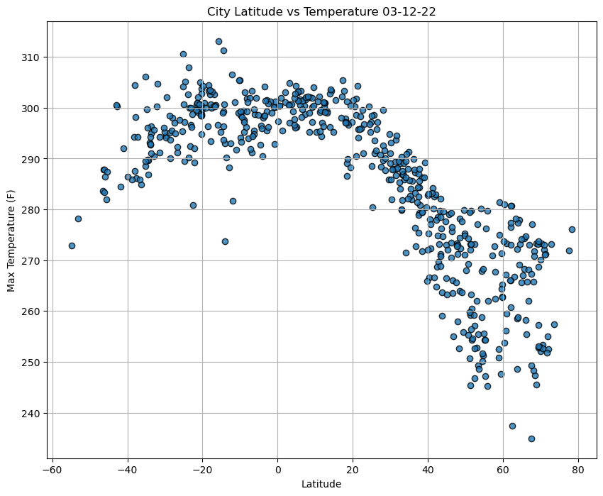
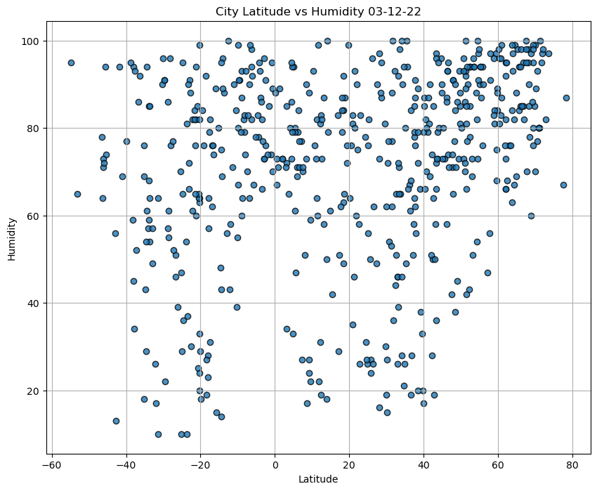
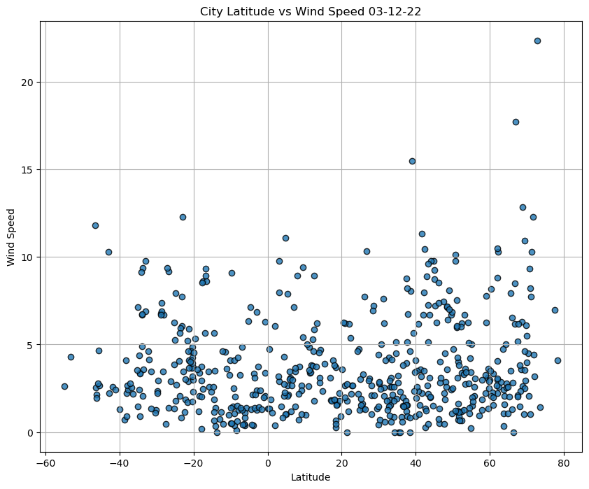
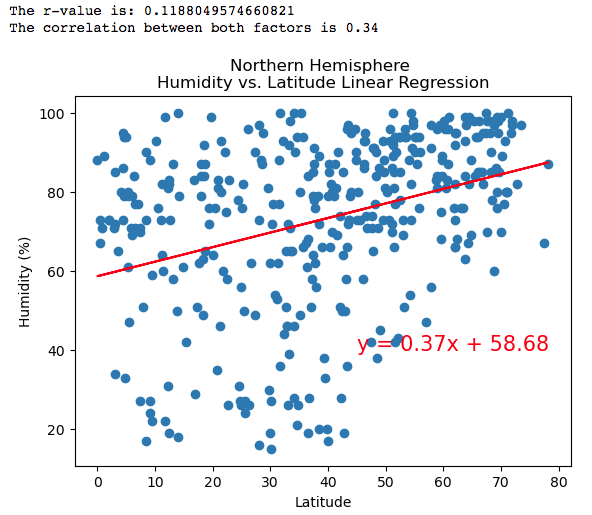
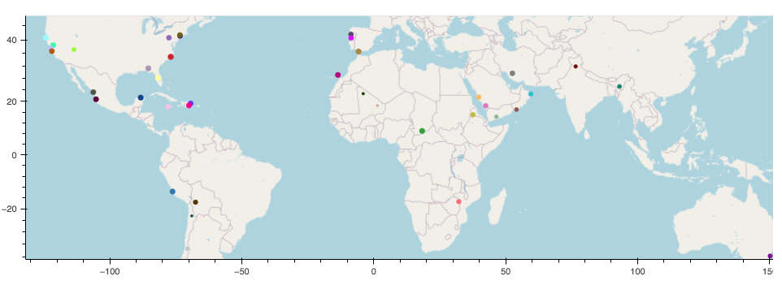

# <p align="center"><ins>Python API Challenge<ins/></p>

  ## <ins>Background<ins/>

  Data's true power is its ability to definitively answer questions. So, in this project I will showcase what I have learned about Python requests, APIs, and JSON traversals to answer a fundamental question: **"What is the weather like as we approach the equator?"**

Now, I know what you may be thinking: **“That’s obvious. It gets hotter.”** But, if pressed for more information, how could we prove that? 
  
  Although the whole project is broken down into two main parts, WeatherPy is broken into a further two parts, which will be discussed below.
  
  [WeatherPy](#weatherpy) | [VacationPy](#vacationpy)
  
### <ins>API Key<ins/>
  
If you wish to run the scripts locally for both [WeatherPy](WeatherPy.ipynb), and [**VacationPy**](VacationPy.ipynb) then you will need to obtain an API keys. For part one, you will need to obtain an API key from the OpenWeatherMap API, which can be obtained [here](https://home.openweathermap.org/api_keys). After you have the OpenWeatherMap API key, in the **WeatherPy** folder, [**config.py**](WeatherPy/api_keys.py) file, add the API key there. See image below:

```bash
weather_api_key="API_KEY_HERE"

```

### <ins>WeatherPy<ins/>

What is the weather like as we approach the equator line? This analysis will focus on the relationships between 'Latitude' and Temperature(F), Humidity(%), Cloudiness(%), and Wind Speed(mph).

### <ins>**Part one**<ins/>

This part focuses on the whole dataset.

### Temperature (F) vs. Latitude

<p align="center">
  
</p>

The above scatter plot shows that any cities located closer to the equator line, tend to have higher temperatures and for any cities further away from the equator line tend to be lower in temperature. The closer the city to the equator line, the closer the city to the sun. 
  
---
### Humidity (%) vs. Latitude

<p align="center">
  
</p>

The above scatter plot shows the irrelevant relation of the city's location and percentage of humidity.

---
### Cloudiness (%) vs. Latitude

<p align="center">
  
</p>

The scatter plot shows that there is no significant relation between city location and the density of clouds.

---
### Wind Speed (mph) vs. Latitude

<p align="center">
  
</p>

This scatter plot shows that there is no significant link between where the cities are located and the wind speed. 

---
### <ins>Part two<ins/>

In this part of the project, I have compared the above factors of Northern and Southern Hemisphere

### <p align="center">Northern and Southern Hemisphere - Temperature (F) vs. Latitude</p>


<table>
  <tr>
    <td></td>
    <td></td>
  </tr>
 </table>


  
**<ins>Discussion about the linear relationship:<ins/>**  

The linear regression lines and correlation values between latitude (north and south) and maximum temperature show that city latitude is correlated to temperature. This proves the point I had mentioned earlier. The further away we go from the equater line (latitude 0) the maximum Temperature (F) will decrease. The closer we get to the equater(latitude 0) the maximum Temperature (F) will increase.
  
  
---
### <p align="center">Northern and Southern Hemisphere - Humidity (%) vs. Latitude</p>

<table>
  <tr>
    <td>
    <td> 
</tr>
 </table>

**<ins>Discussion about the linear relationship:<ins/>** 

The above figures show that there is a weak correlation between city location and humidity in a particular area. Humidty can not be measured or predicted when making connections with the Latitude (location). 

---
### <p align="center">Northern and Southern Hemisphere - Cloudiness (%) vs. Latitude</p>

<table>
  <tr>
    <td>
    <td> 
</tr>
 </table>

**<ins>Discussion about the linear relationship:<ins/>** 

The above figures show that there is a weak correlation between city location and cloudiness. The cloudiness can not be measured or predicted when making connections with the Latitude (location). 

---
### <p align="center">Northern and Southern Hemisphere - Wind Speed (mph) vs. Latitude</p>

<table>
  <tr>
    <td>
    <td> 
</tr>
 </table>

**<ins>Discussion about the linear relationship:<ins/>** 

The above figures show that there is a weak correlation between city location and wind speed. The wind speed can not be measured, defined or predicted when making connections with the Latitude (location). 
  
---
## <ins>VacationPy<ins/>

For this part of the project I used my weather data skills to plan future vacations. I also uses Jupyter notebooks, the geoViews Python library, and the Geoapify API to help create map visualisations.
  
  
### Humidity City Map

The map below displays a point for every city in the 'city_data_df' DataFrame. The size of the point is the humidity in each city.
  
<p align="center">
  
</p>

### Vacation Map

This map will help plan vacations by looking at the above factors, as well as outputting the hotel name and the country as additional information in the hover message for each city on the map.

<p align="center">
  
</p>

  
  <p align="center">
  
</p>


